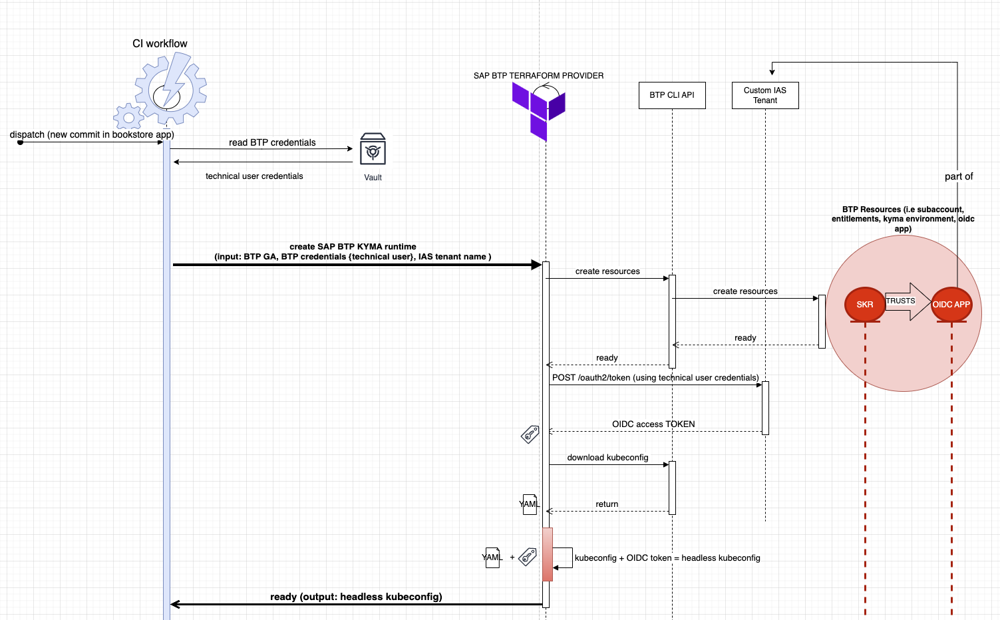

# terraform-sap-kyma-on-btp

## Status

## Overview

Terraform module that creates kyma runtime in SAP BTP platform.

### Input Variables

### Outputs

## Running `terraform-sap-kyma-on-btp` module

The module should be included as a child module, and provided with a configured `sap/btp` terraform provider. The root module must define the values for the input variables. Go to the included [examples](./examples/).

## Useful Links (Optional)
> Provide links to the most relevant module documentation (tutorials, technical references, resources, etc.).

## Feedback (Optional)
> Describe how users can provide feedback.
